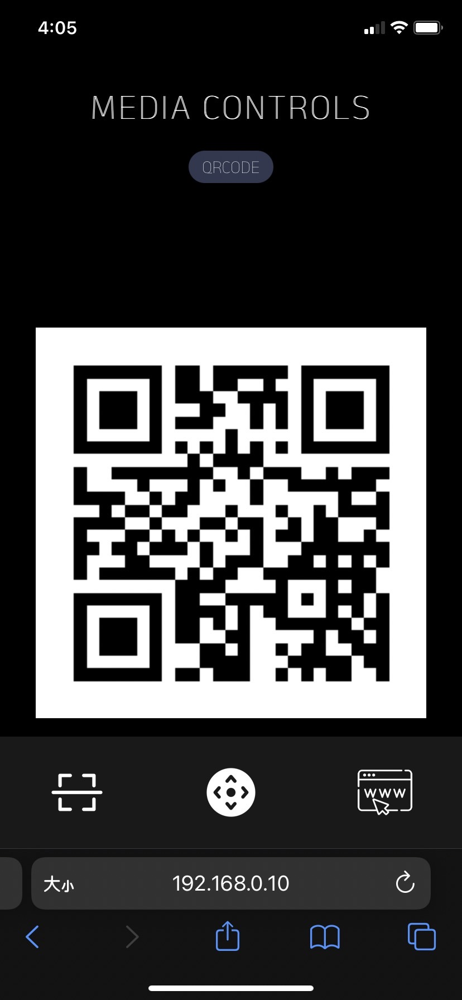
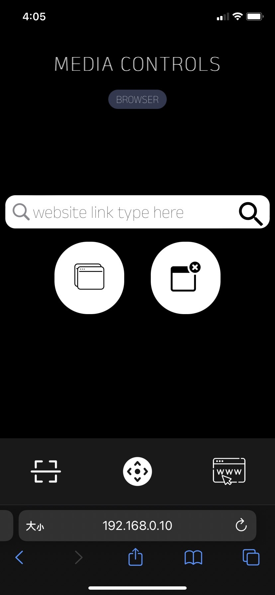
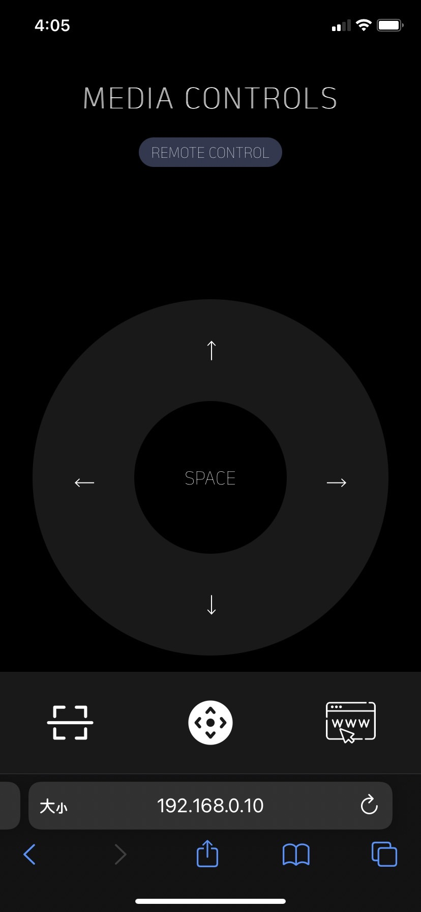

# Keyboard Remote Control

> using Nextjs + Robotjs created a phone remote controller.

### Install (just once)

```
cd frontend/ && npm install
cd backend/ && npm install
npm run build
```

### How to use
```
npm run start // listening on 0.0.0.0:3000
```

- Support arrow keys
- Support switch browser tabs
- Support close browser window
- Support goto specific url





